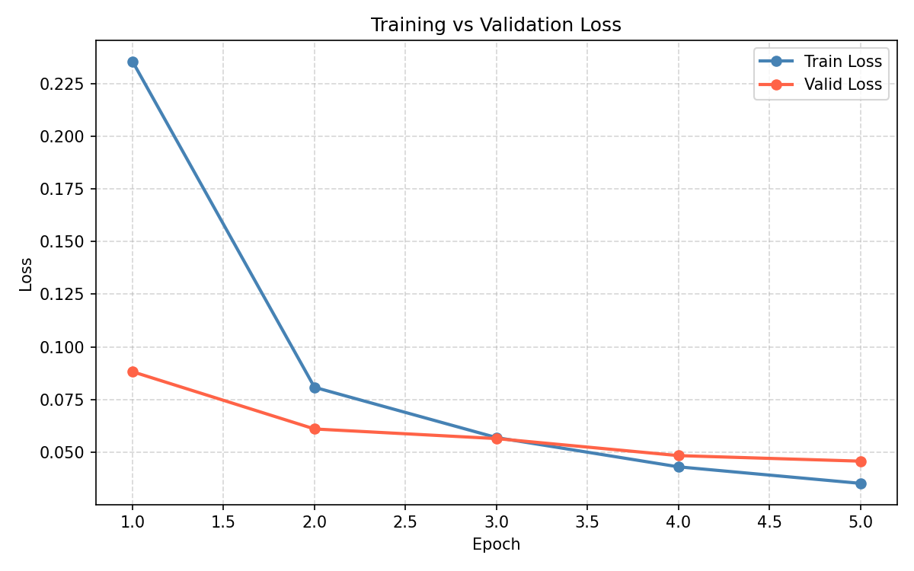
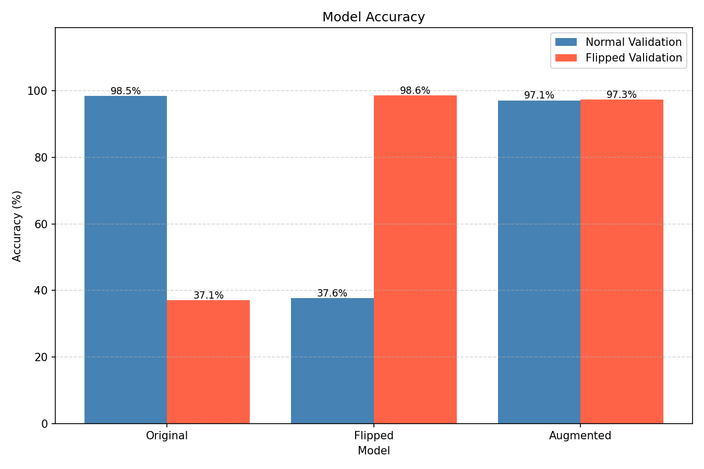
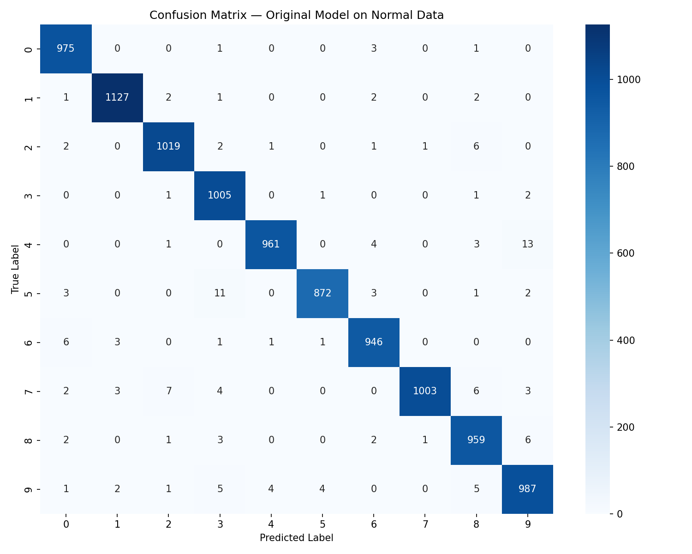

# CNN MNIST Digit Classifier

A Convolutional Neural Network (CNN) trained on the classic [MNIST digits dataset](https://en.wikipedia.org/wiki/MNIST_database) 
to classify handwritten digits (0–9), with experiments investigating model robustness to image orientation.

The MNIST dataset consists of grayscale images of handwritten digits, each with dimensions of 28×28 pixels, 
with corresponding labels from 0 to 9.

---

## Overview
This project demonstrates how to build, train, and evaluate a simple CNN using PyTorch. Beyond basic 
training, the project includes a series of experiments on vertically flipped images to investigate 
**distribution shift** — a fundamental concept in machine learning where a mismatch between training 
and test data leads to dramatic drops in performance. The experiments show that **data augmentation** 
is a simple yet powerful fix, producing a robust model that performs consistently across both normal 
and flipped images.

---

## Model Architecture
A simple CNN built with PyTorch consisting of one convolutional block followed by fully connected layers:

| Layer | Type | Output Shape | Parameters |
|-------|------|-------------|------------|
| Input | — | (1, 28, 28) | — |
| Conv2d (5×5, 16 filters) | Feature Extraction | (16, 24, 24) | 416 |
| ReLU | Activation | (16, 24, 24) | — |
| MaxPool2d (2×2) | Downsampling | (16, 12, 12) | — |
| Flatten | — | (2304,) | — |
| Linear (2304 → 128) | Classification | (128,) | 295,040 |
| ReLU | Activation | (128,) | — |
| Linear (128 → 10) | Output | (10,) | 1,290 |

**Total parameters:** 296,746  
**Loss function:** CrossEntropyLoss  
**Optimizer:** Adam (lr=0.001)  
**Batch size:** 64  
**Epochs:** 5  

---


## Results

### Baseline Training
The model was trained on normal MNIST images for 5 epochs:

| Epoch | Train Loss | Valid Loss | Valid Accuracy |
|-------|-----------|-----------|---------------|
| 1 | 0.217 | 0.087 | 97.00% |
| 2 | 0.073 | 0.062 | 98.00% |
| 3 | 0.052 | 0.055 | 98.00% |
| 4 | 0.041 | 0.045 | 98.00% |
| 5 | 0.035 | 0.054 | 98.00% |

The loss curves show rapid improvement in the first two epochs followed by gradual 
convergence. Training and validation loss nearly meet by epoch 5, indicating a 
well-fitted model with minimal overfitting.



---

### Orientation Experiments
To investigate model robustness, we tested three models across two validation sets:

| Model | Normal Val | Flipped Val |
|-------|-----------|------------|
| Original (trained on normal) | 98.46% | 37.11% |
| Flipped (trained on flipped) | 37.62% | 98.59% |
| Augmented (trained on both)  | 97.14% | 97.33% |

The bar chart below makes the distribution shift immediately visible — each 
specialized model excels on its own orientation while failing on the other. 
The augmented model achieves balanced performance across both.



**Key findings:**
- CNNs are highly sensitive to distribution shift — a 60% accuracy drop from simply 
  flipping images
- The drop is perfectly symmetric in both directions, confirming it is purely a 
  training/test mismatch
- Data augmentation (p=0.5 random vertical flip) resolves the issue with only a 
  ~1.3% tradeoff on normal accuracy

---

### Confusion Matrix
The confusion matrix below shows the original model's predictions across all 10 digit 
classes on the normal validation set. The strong diagonal confirms high accuracy 
throughout, with the most notable confusions being:

- **4 → 9**: 11 misclassifications (visually similar closed tops)
- **5 → 3**: 10 misclassifications (similar curve structure)
- **7 → 9**: 10 misclassifications (similar diagonal strokes)

These errors are consistent with human perception — the confused pairs are among 
the most visually similar digits in the dataset.



---

## How to Run

### 1. Clone the repository
```bash
git clone https://github.com/YOUR_USERNAME/cnn-mnist-digit-classifier.git
cd cnn-mnist-digit-classifier
```

### 2. Set up a virtual environment
```bash
python -m venv venv
source venv/bin/activate        # Mac/Linux
venv\Scripts\activate           # Windows
```

### 3. Install dependencies
```bash
pip install -r requirements.txt
```

### 4. Run the notebook
```bash
jupyter notebook cnn_mnist.ipynb
```
The MNIST dataset will be downloaded automatically into the `data/` folder on first run.

---

## Requirements
- Python 3.8+
- torch
- torchvision
- torchsummary
- matplotlib
- jupyter
- seaborn

See `requirements.txt` for exact versions.

---

## Project Structure
```
cnn-mnist-digit-classifier/
├── cnn_mnist.ipynb      ← main notebook with all code and experiments
├── requirements.txt     ← dependencies
├── data/                ← MNIST dataset (auto-downloaded)
└── README.md
```

---

## Key Concepts Covered
- Convolutional Neural Networks (CNNs)
- Data loading and preprocessing with `torchvision`
- Model architecture design and parameter calculation
- Training and validation loops in PyTorch
- Loss functions and optimizers
- Distribution shift and model robustness
- Data augmentation as a regularization technique

---

## License
MIT